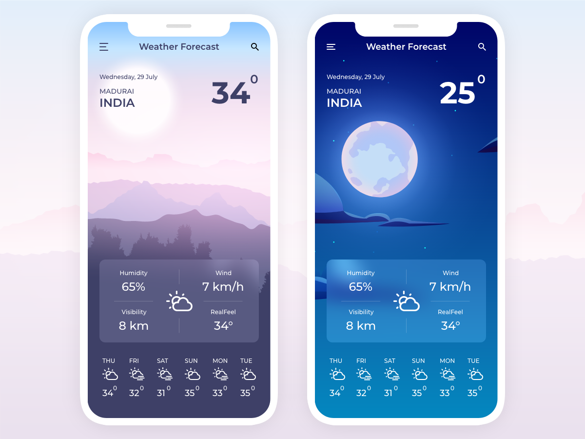
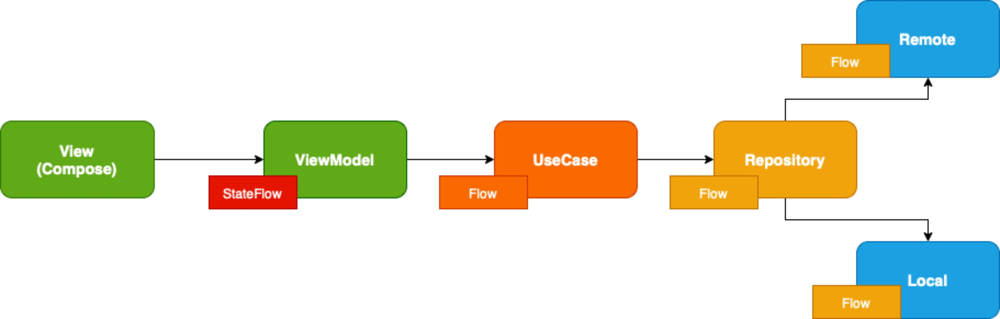

# Weather app - Jetpack Compose Clean Architecture Example
Weather app is an example for show current weather from World Cities, built with Jetpack Compose. 
The goal of the sample is to showcase the current UI capabilities of Compose.
Design pattern: Clean Architecture & MVVM 



## Features
The example shows current weather from World Cities and other information such as:
- Weather for the next 20 hours
- Tomorrow's weather
- Weather for the next 7 days

## Introduction
-------------

### Data-Flow


Updating...

**Credit**

### This app inspired from [Weather App Challenge] concept Designed by [Rajesh Kumar]

## License
```
Copyright 2020 The Android Open Source Project

Licensed under the Apache License, Version 2.0 (the "License");
you may not use this file except in compliance with the License.
You may obtain a copy of the License at

    https://www.apache.org/licenses/LICENSE-2.0

Unless required by applicable law or agreed to in writing, software
distributed under the License is distributed on an "AS IS" BASIS,
WITHOUT WARRANTIES OR CONDITIONS OF ANY KIND, either express or implied.
See the License for the specific language governing permissions and
limitations under the License.
```


[Weather App Challenge]: https://www.uplabs.com/posts/weather-app-challenge-af378b48-496a-46aa-a180-5f71ebf3cf03
[Rajesh Kumar]: https://www.uplabs.com/rcrajeshkumar    